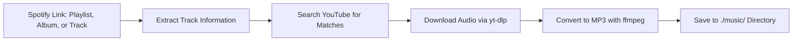

# 🎵 Spotify Downloader (C#)

Download your **Spotify playlists, albums, and tracks** for free!  
This C# application takes a **Spotify link** (album, playlist, or track) and downloads the corresponding audio directly from **YouTube** using [YoutubeDLSharp](https://github.com/Bluegrams/YoutubeDLSharp), converting it with `ffmpeg`.  

---

## 🔄 How It Works


---

## ✨ Features
- 🔗 Paste a **Spotify link** (playlist / album / track) and let the app do the rest
- 🎶 Downloads full **playlists**, **albums**, or single tracks
- 🎵 Converts audio to MP3 format using `ffmpeg`
- 🚀 Built with **.NET 9** for modern performance
- 🖥 Cross-platform support: **Windows**, **macOS**, **Linux**
- 📁 Organizes downloads in a local `music` directory
- 🔍 Multiple extraction methods for maximum compatibility
- 📊 Real-time progress tracking and colored console output

---

## 🔧 Installation

### Option 1: Using Pre-built Executable (Recommended)

**Only requirement: Install ffmpeg**
- **macOS:** `brew install ffmpeg`
- **Windows:** Download from [ffmpeg.org](https://ffmpeg.org/download.html) and add to PATH
- **Linux:** `sudo apt install ffmpeg`

**Then:**
1. Go to [Releases](https://github.com/yourusername/spotify-downloader-cs/releases/latest)
2. Download the executable for your OS
3. Run it!

### Option 2: Build from Source

**Requirements:**
- [.NET 9 SDK](https://dotnet.microsoft.com/download/dotnet/9.0)
- [yt-dlp](https://github.com/yt-dlp/yt-dlp) 
- [ffmpeg](https://ffmpeg.org/download.html)

**Install dependencies:**
- **macOS:** `brew install yt-dlp ffmpeg`
- **Windows:** `pip install yt-dlp` + download ffmpeg from [ffmpeg.org](https://ffmpeg.org/download.html)
- **Linux:** `pip install yt-dlp && sudo apt install ffmpeg`

**Build and run:**
```bash
git clone https://github.com/Daniel-191/Spotify-Downloader-cs
cd Spotify-Downloader-cs
dotnet restore
dotnet run
```

---

## 🚀 How to Use

1. Run the application
2. Paste a Spotify URL when prompted:
   - `https://open.spotify.com/track/...` (single song)
   - `https://open.spotify.com/album/...` (full album)  
   - `https://open.spotify.com/playlist/...` (playlist)
3. Press Enter and wait for downloads to complete
4. Find your MP3 files in the `./music/` folder

---

## 🖥 Supported Operating Systems
- ✅ **Windows** (with .NET 9)  
- ✅ **macOS** (with .NET 9)  
- ✅ **Linux** (with .NET 9)  

---

## 🛠 Configuration

The application automatically detects system paths for:
- **macOS:** `/opt/homebrew/bin/yt-dlp` and `/opt/homebrew/bin/ffmpeg`
- **Windows:** `yt-dlp.exe` and `ffmpeg.exe` (from PATH)

You can modify the paths in `Program.cs` if your installation locations differ.

---

## 📁 Project Structure
```
spotify-downloader-cs/
├── Program.cs              # Main application logic
├── spotify-downloader-cs.csproj  # Project configuration (.NET 9 + YoutubeDLSharp)
├── music/                  # Downloaded audio files (created automatically)
└── README.md              # This file
```

---

## 🎯 Features in Detail

- **Multiple Extraction Methods:** Uses oEmbed API, embed pages, direct pages, and manual input as fallbacks
- **Smart Regex Parsing:** Advanced pattern matching to extract track and artist information
- **JSON Data Processing:** Parses embedded JSON data for accurate track extraction  
- **Error Handling:** Comprehensive error handling with colored console feedback
- **Progress Tracking:** Real-time download progress with formatted output
- **Dependency Checking:** Automatic verification of required tools (ffmpeg, yt-dlp)
- **YoutubeDLSharp Integration:** Uses the [YoutubeDLSharp](https://github.com/Bluegrams/YoutubeDLSharp) C# wrapper for seamless yt-dlp integration

---

> [!WARNING]  
> This project is for **educational purposes only**.  
> Please support artists by streaming legally on [Spotify](https://spotify.com).

---

## 📄 License
This project is provided as-is for educational purposes. Please respect copyright laws and support artists through official channels.
